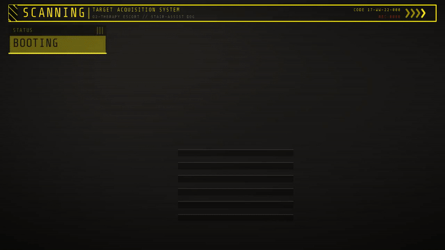

# WARNING // Target-Acquisition HUD

A ground-up, **opaque yellow hazard HUD** (ref1 style — bright angular
black-on-yellow WARNING panels) laid over a live OpenCV feed, tuned for the
O2-therapy stair-assist follow dog.  It boots up, then plays
**LOCKED → TARGET LOST → REACQUIRE** with synced bleeps and dynamic info cards
that spawn / collapse as the scene needs them.



This **is** the repo's runtime overlay: the renderer lives in
[`core/hud/warning_kit.py`](../core/hud/warning_kit.py) and drives both this demo
**and** the live sim recordings (`core/hud/visualization.py` maps the robot's
telemetry into it). It replaced the earlier red "GO2 // TACTICAL" overlay, so
`run_sim.bat` now records with this HUD.

## What's on screen (all real — no fabricated telemetry)

- The camera **is the whole screen**; the HUD floats opaque on top with target
  brackets + a lock reticle on the primary detection (secondary contacts get
  light brackets).
- The big **WARNING** header only fires when the target is genuinely **lost** (a
  sustained ~10 s absence, debounced so per-frame detection dropouts don't trip
  it) or the robot fell — otherwise the header reads a calm status word. Proximity
  still reddens the range readout, but doesn't raise the alarm.
- The **target reticle** is a modest capped targeting box that stays a sane size
  even when the patient fills the frame, and stays on-screen when they're off to a
  side.
- A header **DRIVE chip** shows the active locomotion backend; **BLIND-RL** is
  highlighted (orange + pulse + toast) since it's the experimental climber, so it
  stands out clearly from PGTT.
- The info cards use **mixed styles** (solid plate / bracket-framed / underlined /
  hazard-alert) so they read distinctly instead of all looking the same.
- Two persistent yellow **instrument panels** in the bottom corners:
  - `DEPTH // D435` — a real **colour** depth map (TURBO: near = warm, far = cool,
    with a NEAR/FAR legend) so structure is readable, plus a stair-detection badge.
  - `LIDAR // XT16` — a dense forward **clearance bar-graph** (ref1 bar-array
    vibe): one bar per bearing bin, tall = open, red/amber dips = close obstacles;
    the tracked patient's bearing is flagged (`TGT`), with range gridlines and
    FWD / MIN / status readouts.
- A compact persistent `STATUS` card (state + mode + target count); fps lives in
  the footer. Only the useful CV signals are surfaced — no filler.
- **Transient UI that spawns-in then spawns-out** (info you don't need at a glance):
  - `TARGET // PATIENT-01` detail card — confidence + range + azimuth/elev; pops
    up on acquire, holds a few seconds after lock, then collapses.
  - `! ALERT` card — only while the target is lost (hazard header + countdown).
  - `CONTACT-02` card — only when there are 2+ targets.
  - Top-centre **toasts** — `TARGET ACQUIRED`, `CONTACT-02 DETECTED`,
    `STAIRS AHEAD` — bleep in, linger ~2 s, bleep out.
- Colour-coded: yellow while nominal, hot-red for danger (target lost / near).

On the **webcam** path a laptop has no depth cam / LiDAR, so those two panels are
honestly hidden — the feed, reticle, status, and detail cards still run.

## Why opaque (and not arcv's GPU `Overlay`)

ref1 is fundamentally solid **black-on-yellow**.  arcv composites its HUD
*additively* (glow), which can only ever brighten — it physically cannot draw
black ink on a bright panel.  So the panels here are alpha-composited opaquely
with cv2, while text uses the **arcv-bundled Share Tech Mono** face
(`arcv/resources/fonts/ShareTechMono-Regular.ttf`) via Pillow.

The [arcv](https://pypi.org/project/arcv/) library still does what it is uniquely
good at: **synced audio bleeps** (`arcv.audio.Bleeps` live + `render_track` for
muxed export), **real CV detectors** (`arcv.vision.FaceDetector` on the webcam
path), and animation-timing eases.

## Run it

```bash
# live window over your webcam (real face detection drives the state + sound):
python examples/warning_hud.py --source webcam

# scripted showcase over a simulated feed (live window + sound):
python examples/warning_hud.py --source sim

# render the showcase to a shareable MP4 (+GIF) with muxed audio
# (no display or camera needed — the "view it later" path):
python examples/warning_hud.py --record examples/media/warning_hud.mp4 --seconds 13

# per-state stills for quick offline judging:
python examples/warning_hud.py --preview examples/media
```

## Files

| File | Role |
|------|------|
| `../core/hud/warning_kit.py` | reusable renderer — palette, Share Tech Mono text (bundled TTF), opaque angular panels, dynamic `CardStack` + toasts, full-screen target reticle, DEPTH raster + LiDAR bar-graph panels, and the `Telemetry`/`Target` data model. Used by the sim runtime AND this demo. |
| `../core/hud/visualization.py` | the sim runtime compositor — maps the robot's `debug_info`/`frame_meta` into `Telemetry` and composites the HUD onto recorded/preview frames. |
| `warning_hud.py` | runnable demo — sim / webcam sources, the presence-driven state machine, synced audio (live + muxed export), MP4/GIF recording, per-state preview. |
| `../tests/test_warning_hud.py` | headless smoke + behaviour tests (render every state, cards spawn/collapse, honest telemetry, state walk). |

Requires `arcv`, `opencv-python`, `pillow`, `numpy` (all already used by the
project).  `sounddevice` (live sound) and `ffmpeg` (audio mux / GIF) are optional
and degrade gracefully.
