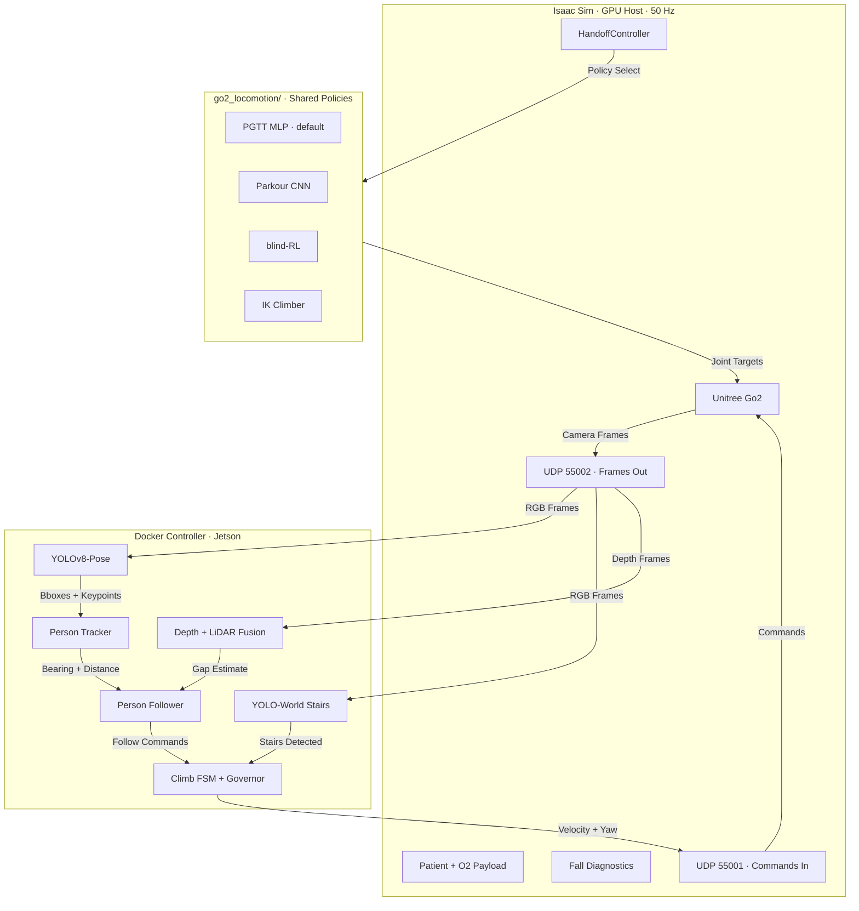
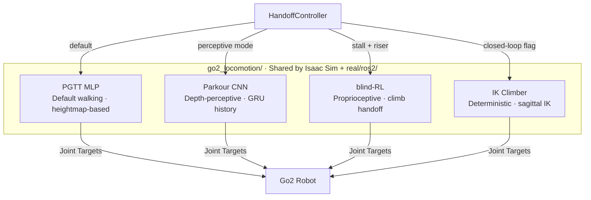
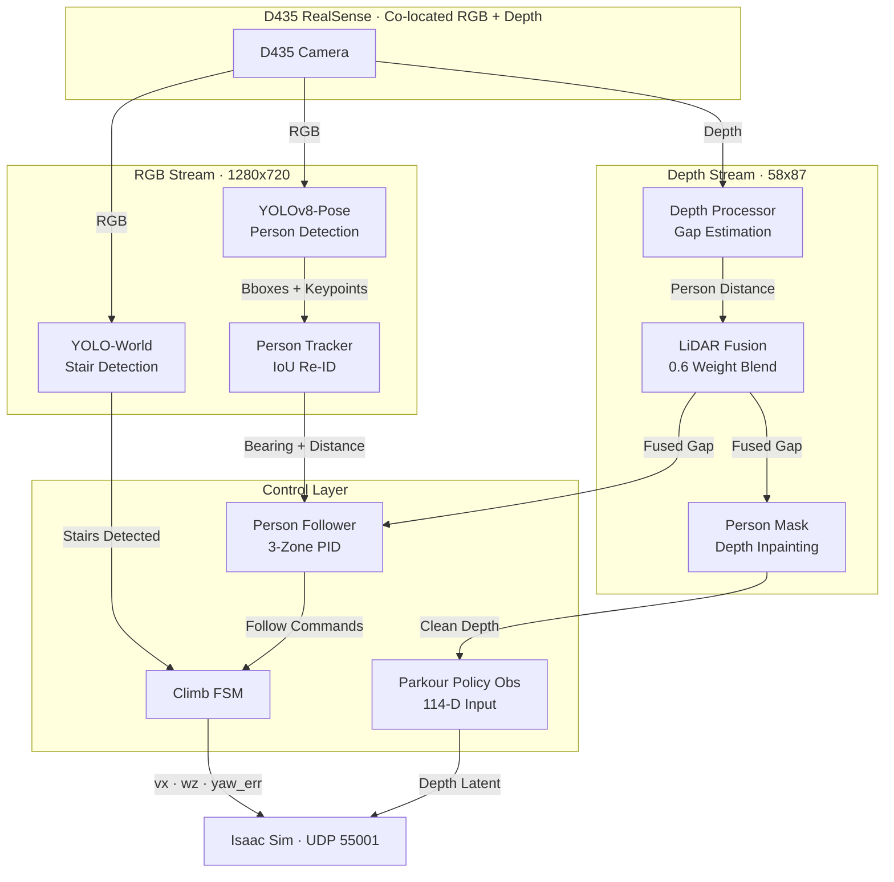
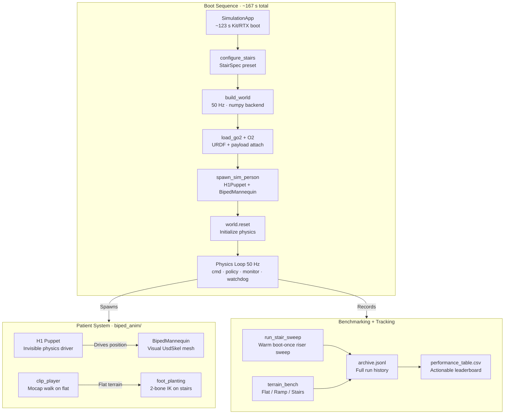

# Stair-Climbing Robotic Dog for Oxygen Therapy Patients

A **Unitree Go2** quadruped that autonomously follows an oxygen therapy patient, carries a P2-E6 concentrator payload, and climbs staircases alongside them. Runs in NVIDIA Isaac Sim for development and deploys on an NVIDIA Jetson Orin for real hardware.

---

## Key Features

- **Multi-Policy Locomotion** — Four interchangeable backends: PGTT MLP (default walking), Parkour CNN (depth-perceptive terrain), blind-RL (proprioceptive climb handoff), and a deterministic IK Climber. All live in `go2_locomotion/` shared between sim and the real ROS2 port.
- **Autonomous Policy Handoff** — `HandoffController` detects stall + riser conditions at 50 Hz and switches from walking to a climb backend; top-of-stairs egress walks the robot clear before handing back.
- **Person Tracking & Following** — YOLOv8-Pose TRT detects the patient; `SinglePersonTracker` maintains a lock with 3-second occlusion prediction; a 3-zone PID follows at a 0.45 m standoff.
- **Stair Detection** — YOLO-World open-vocabulary model counts risers in real time; ≥ 2 risers at < 1.6 m triggers the climb sequence.
- **Depth Masking** — Patient bounding box is inpainted out of the depth frame before it reaches the Parkour CNN, eliminating close-range surge.
- **LiDAR + Depth Fusion** — Simulated Hesai XT16 LiDAR fused with depth camera at 0.6 weight for robust gap estimation and obstacle gating.
- **O₂ Payload Monitor** — Physics-attached rail + tank with 600 N breakable strap; CoM shift and strap force monitored every physics step.
- **Patient Animation** — Procedural biped gait with mocap clip playback on flat and 2-bone IK foot-planting on stairs.

---

## System Architecture

### 1. System Overview



---

### 2. Locomotion Policies



---

### 3. Perception Pipeline



---

### 4. Policy Handoff & Climb State Machines

```mermaid
graph TD
    subgraph Handoff [HandoffController · Isaac Sim · 50 Hz]
        WALK[WALK\nPGTT or Parkour active]
        CLIMB[CLIMB\nblind-RL / Parkour / IK]
        TOPEGRESS[TOP EGRESS\nWalk clear of crest]
        WALK_R[WALK Resumed]
        ABORT[ABORT]

        WALK -->|stall + riser detected| CLIMB
        CLIMB -->|crest clear| TOPEGRESS
        CLIMB -->|timeout or tilt exceeded| ABORT
        ABORT -->|reset| WALK
        TOPEGRESS -->|egress complete| WALK_R
        WALK_R -->|re-trigger| CLIMB
    end

    subgraph ClimbFSM [ClimbFSM · follow_shaping.py · Docker]
        FF[FLAT FOLLOW]
        SA[STAIR APPROACH]
        SN[STAIR NEAR]
        CC[COMMITTED CLIMB]
        LF[LOSS OF FLOOR]
        STOP[STOP]

        FF -->|stairs detected| SA
        FF -->|person lost| LF
        SA -->|range close| SN
        SA -->|stairs lost| FF
        SN -->|handoff active| CC
        SN -->|stairs gone| LF
        CC -->|stairs gone mid-climb| LF
        CC -->|climb complete| FF
        LF -->|stairs reacquired| CC
        LF -->|timeout| STOP
        STOP -->|person reacquired| FF
    end

    subgraph FallDiag [Fall Diagnostics · debug/isaac_env.jsonl]
        FD[Fall Detector]
        V[Verdict\nFELL · COLLIDED · CLEAN CLIMB]
        FD -->|physics stream| V
    end
```



---

### 5. Isaac Sim — World Components



---

## Project Structure

```
core/                          Docker controller process
  main.py                      Main runtime loop
  args_parser.py               CLI argument parsing
  control/
    climb_fsm.py               6-state ClimbFSM
    follow_shaping.py          Speed governor + stair command shaping
    person_follower.py         3-zone PID person follower
    pid_controller.py          PID implementation
    stair_policy.py            Stair forward command policy
  vision/
    depth_processor.py         Depth gap estimation
    lidar_fusion.py            Camera + LiDAR depth fusion
    single_person_tracker.py   IoU re-ID tracker
    yolo_pose_inference.py     YOLOv8-Pose person detection
    yolo_stairs_inference.py   YOLO-World stair detection
  hud/                         HUD overlay rendering
  telemetry/                   Telemetry publishing

go2_locomotion/                Shared locomotion policies (sim + real ROS2)
  pgtt_locomotion_policy.py    PGTT MLP — default walking policy
  pgtt_stair_handoff.py        HandoffController FSM
  parkour_locomotion_policy.py Extreme-Parkour-Onboard CNN
  rl_locomotion_policy.py      blind-RL proprioceptive policy
  closed_loop_stair_climber.py Deterministic IK Climber

sim/                           Isaac Sim environment
  isaac/
    isaac_env.py               Sim entry point · 50 Hz physics loop
    biped_anim/                Patient procedural gait (clip + IK)
    world/                     World actors (H1 puppet, patient body)
    perception/                Sim-side perception helpers
    terrain_bench/             Multi-terrain benchmark runner
    o2_payload/                O2 payload physics + monitor
  analysis/                    Run analysis tools
  models/                      All model checkpoints
    locomotion/                Go2 policy files
    yolo/                      YOLO models
    pgtt/                      PGTT heightmap model
  run_sim.bat / run_sim.ps1    Primary sim launcher
  run_stair_sweep.bat / .ps1   Warm riser sweep
  run_bench.bat / .ps1         Multi-terrain benchmark

perf_tracker/                  Run tracking
  archive.jsonl                Full run history (source of truth)
  performance_table.csv        Lean actionable leaderboard

real/                          ROS2 Foxy real-robot port (deferred until sim proven)
  ros2/                        Thin rclpy nodes
  control/                     Pure host-tested control

docker/                        Dockerfiles + compose for controller container
ros2_ws/                       ROS2 workspace (Nav2 Humble sidecar)
fine_tuning/                   RunPod RL retrain scaffold
tests/                         Host-side pytest suite
```

---

## Getting Started in Simulation

Ensure **NVIDIA Isaac Sim** is installed and **Docker Desktop** is running.

### Interactive launcher (btop-style)

The quickest way to start either target is the **interactive launcher** — a
btop-style terminal interface (see [`DESIGN.md`](DESIGN.md)) where you pick the
flags on screen and watch a live dashboard of the run:

```powershell
.\launch.bat             # Windows: interactive start screen (sim by default)
.\launch.bat --preview   # static UI preview, no GPU/Isaac needed
```
```bash
./launch.sh              # Linux / real robot
./launch.sh --real       # preselect the real Go2 EDU target
```

Keys: `↑/↓` move · `←/→` or `Space` change a flag · `Tab` switch sim/real ·
`Enter` launch · `q` quit. After launch it drops into a **full-screen TUI
dashboard** — a header/footer status bar, a live pipeline timeline, a
**scrollback console** (`↑/↓`/`PgUp`/`PgDn` to scroll, `End` to follow live),
and a **toggleable telemetry panel** (`t` switches between *robot pose* — x,
height, pitch/roll, policy command, x-trace — and *mission* — handoff phase,
climb step, person-gap, stairs/climb-gate, body speed, tilt), all read live
from the run's fall-diagnostic stream. The layout is responsive (side-by-side
grid on wide terminals, stacked on narrow) and fills the screen. Press `q` (or
`Ctrl-C`) to stop the run.

The launcher just assembles and runs the normal command shown in its
**command** panel — so you can **still run everything directly** with the
commands below (now also btop-styled). `--no-color` / `NO_COLOR` disables the
styling everywhere; `--no-dashboard` streams the underlying launcher instead of
the TUI.

### Direct commands

```powershell
# Standard launch — Isaac Sim GUI + Docker controller
.\sim\run_sim.bat

# Headless + fast render
.\sim\run_sim.bat --headless --fast-render

# Warm start — keeps Isaac alive between runs (skips ~123 s RTX boot)
.\sim\run_sim.bat --headless --fast-render --warm
.\sim\run_sim.bat --warm-shutdown        # clean stop

# Self-test walk — drives policy directly without Docker
.\sim\run_sim.bat --self-test-walk --self-test-vx 0.5 --self-test-sec 15

# Sim-to-real validation — adds D435 noise, latency, domain randomisation
.\sim\run_sim.bat --sim2real-validation-cam

# Multi-terrain benchmark
cd sim
.\run_bench.bat
.\run_bench.bat --only stairs_steep,ramp_20deg

# Stair-height sweep (warm boot-once, outputs slides + CSV)
.\run_stair_sweep.bat
```

For the complete flag reference and logging layout see [`SIM_FLAGS.md`](SIM_FLAGS.md).
