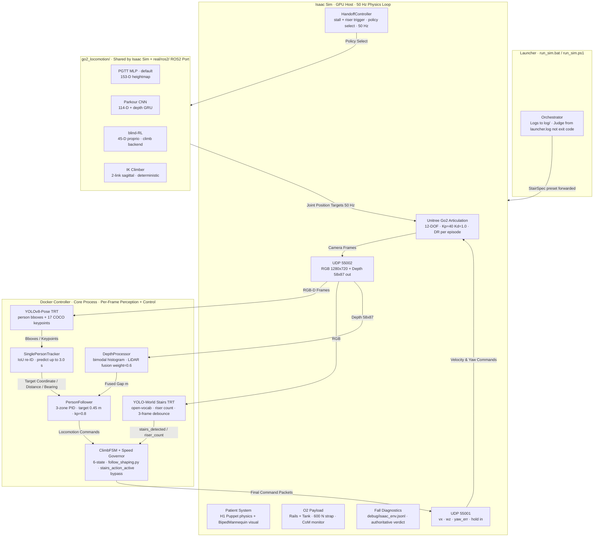
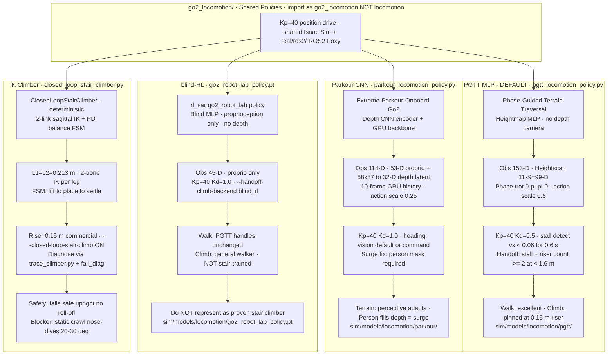
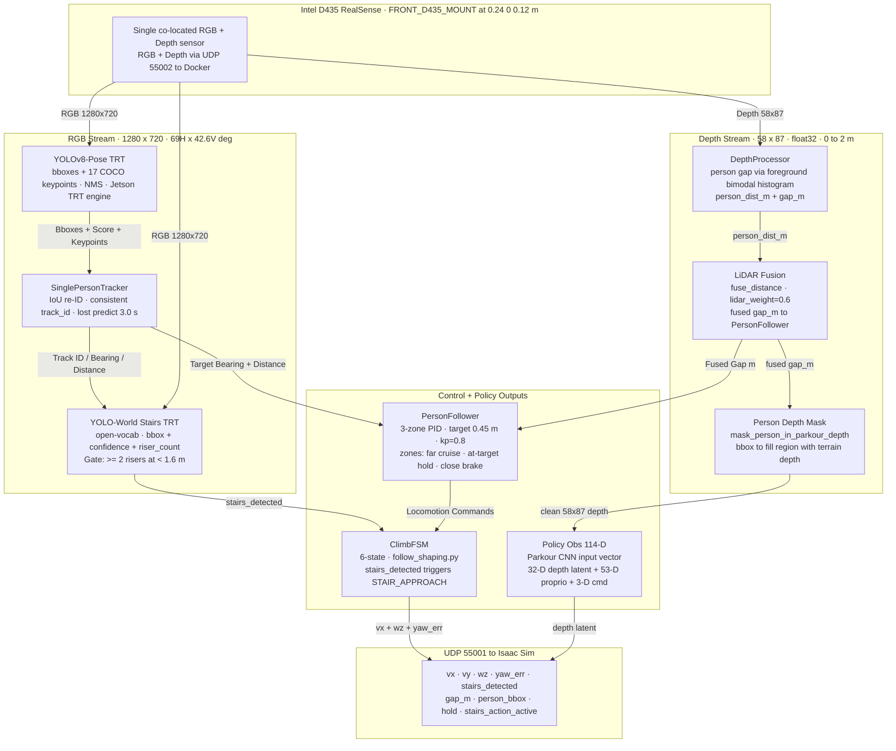
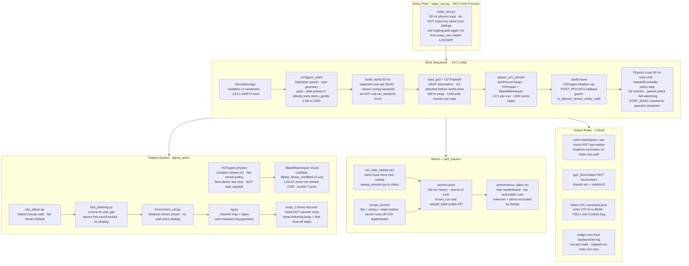

# Stair-Climbing Robotic Dog for Oxygen Therapy Patients

This project enables a quadruped robot (**Unitree Go2**) to serve as an autonomous mobile support companion for oxygen therapy patients. The robot carries a custom 3D-printed payload cradle containing a P2-E6 oxygen concentrator, follows the patient at a safe standoff distance, and autonomously navigates and climbs staircases alongside or behind them.

The system is designed to run in two environments:
1. **Simulation**: Using **NVIDIA Isaac Sim** for high-fidelity physics, vision rendering, and terrain generation.
2. **Real Hardware**: Deployed on a physical **Unitree Go2** robotic dog powered by an onboard **NVIDIA Jetson Orin** system.

---

## 🚀 Key Features

* **Person Tracking**: Integrates YOLOv11/YOLOv8-pose detection with a single-target ByteTrack-based tracker to lock onto and robustly follow the designated patient.
* **Intelligent Person Following**: A custom PID-based tracking controller featuring safety braking zones, low-pass command filtering, and dynamic centering.
* **Stair Climb & Locomotion Policy**: Leverages a learned Parkour Locomotion Policy (walk/jump gaits) to dynamically adapt to flat ground and climb stairs.
* **Perception-Driven Control**: Active depth camera processing with target person bounding-box masking (`terrain-inpaint`) to prevent the robot from misreading the patient's close-range body as high terrain (eliminates surging).
* **Sensor Fusion & Obstacle Gating**: Merges simulated Hesai XT16 LiDAR profiles with depth/camera perception to slow down, square up on stairs, or trigger obstacle stops.
* **Modular Simulation Sandbox**: An Isaac Sim-based environment with configurations for custom stair presets (step height, depth, count), final hospital scene, domain randomization, and sim-to-real noise validation.

---

## 🏗️ System Architecture

### 1. System Overview

The runtime execution is split across two main components communicating over a UDP network interface:



---

### 2. Locomotion Policies

All policies live in `go2_locomotion/` — imported by both Isaac Sim and the real ROS2 port. Do **not** import as `locomotion/` (name collision).



---

### 3. Perception Pipeline



---

### 4. Policy Handoff & Climb State Machines

```mermaid
graph TD
    subgraph Handoff [HandoffController · pgtt_stair_handoff.py · Isaac Sim · 50 Hz]
        WALK[WALK\nPGTT or Parkour active\nstall monitor: vx < 0.06 for 0.6 s\nriser gate: >= 2 at < 1.6 m]
        CLIMB[CLIMB\nblind-RL or Parkour or IK backend\nhandoff dist 0.90 m · abort tilt 0.70 rad\ntimeout 8.0 s · stairs_action_active = true]
        TOPEGRESS[TOP EGRESS\nwalk clear of crest\ndepth-clear AND GT-terrain-clear\nwalk top_egress_distance_m forward]
        WALK_R[WALK resumed\nPGTT or Parkour continues\nstall detector resets · can re-trigger]
        ABORT[ABORT to WALK\ntimeout or tilt > 0.70 rad]

        WALK -->|stall + riser conditions met| CLIMB
        CLIMB -->|crest clear debounced 3-frame| TOPEGRESS
        CLIMB -->|timeout or tilt exceeded| ABORT
        ABORT -->|reset| WALK
        TOPEGRESS -->|egress distance walked| WALK_R
        WALK_R -->|stall + riser re-trigger| CLIMB
    end

    subgraph ClimbFSM [ClimbFSM · core/control/follow_shaping.py · Docker · Per-Frame]
        FF[FLAT_FOLLOW\nnormal PID follow · start state\nperson visible and tracked]
        SA[STAIR_APPROACH\nstairs visible\nheading hold + speed hold\ncreep to riser commit]
        SN[STAIR_NEAR\nstair base reached\nsquare-up + vx floor\nobstacle gate bypassed]
        CC[COMMITTED_CLIMB\nactive climb\nstairs_action_active = true\nheading-lock yaw to 0]
        LF[STAIR_LOSS_FLOOR\nstairs lost mid-climb\nhold last bearing + gap\npredict 3.0 s window]
        STOP[STOP\ncmd = 0 all axes\nwait reacquire\nor operator override]

        FF -->|stairs_detected = true| SA
        FF -->|person lost| LF
        SA -->|range close| SN
        SA -->|stairs lost| FF
        SN -->|HandoffController active| CC
        SN -->|stairs gone| LF
        CC -->|stairs gone mid-climb| LF
        CC -->|climb complete| FF
        LF -->|stairs seen again| CC
        LF -->|timeout| STOP
        STOP -->|person seen again| FF
    end

    subgraph FallDiag [Fall Diagnostics · debug/isaac_env.jsonl · Authoritative]
        FDetect[Fall Detection\nflipped: tilt > 1.05 rad\ncollapsed: height < 0.18 m AND tilt > 0.52 rad\nROBOT_COLLAPSE_TILT_RAD=0.52 guards upright-wedge]
        Verdict[Climb Verdict · analyze_climb\nFELL: sustained fall detected\nCOLLIDED: contact without forward progress\nCLEAN CLIMB: sustained upright progress]
        Source[Authoritative Source\ndebug/isaac_env.jsonl per-step JSONL\nDo NOT use evaluation_summary.txt or max_x alone\nperf_tracker archive.jsonl = full history]
        FDetect --> Verdict --> Source
    end
```



---

### 5. Isaac Sim — World Components



---

## 📂 Project Structure

* **[`core/`](file:///c:/Users/antho/Downloads/Stair-Climbing-Robotic-Dog-for-Oxygen-Therapy-Patients/core)**: Contains the core perception, tracking, and control logic.
  * [`main.py`](file:///c:/Users/antho/Downloads/Stair-Climbing-Robotic-Dog-for-Oxygen-Therapy-Patients/core/main.py): Main runtime loop of the controller.
  * [`person_follower.py`](file:///c:/Users/antho/Downloads/Stair-Climbing-Robotic-Dog-for-Oxygen-Therapy-Patients/core/person_follower.py): PID-based tracking control logic.
  * [`depth_processor.py`](file:///c:/Users/antho/Downloads/Stair-Climbing-Robotic-Dog-for-Oxygen-Therapy-Patients/core/depth_processor.py): Depth image filtering and patient body masking.
  * [`lidar_fusion.py`](file:///c:/Users/antho/Downloads/Stair-Climbing-Robotic-Dog-for-Oxygen-Therapy-Patients/core/lidar_fusion.py): Merges camera detections and LiDAR distance metrics.
  * [`visualization.py`](file:///c:/Users/antho/Downloads/Stair-Climbing-Robotic-Dog-for-Oxygen-Therapy-Patients/core/visualization.py): Visualizes system outputs (Bird's Eye View panel, tracking info, LiDAR points).
* **[`sim/`](file:///c:/Users/antho/Downloads/Stair-Climbing-Robotic-Dog-for-Oxygen-Therapy-Patients/sim)**: Contains Isaac Sim scripts, scene definitions, and launcher files.
  * [`isaac/isaac_env.py`](file:///c:/Users/antho/Downloads/Stair-Climbing-Robotic-Dog-for-Oxygen-Therapy-Patients/sim/isaac/isaac_env.py): Main Isaac Sim environment script.
  * [`run_sim.bat`](file:///c:/Users/antho/Downloads/Stair-Climbing-Robotic-Dog-for-Oxygen-Therapy-Patients/sim/run_sim.bat) / `run_sim.ps1`: Primary simulation orchestrator scripts.
* **[`real/`](file:///c:/Users/antho/Downloads/Stair-Climbing-Robotic-Dog-for-Oxygen-Therapy-Patients/real)**: Execution scripts and interfaces for physical deployment on the real robot.
* **[`docker/`](file:///c:/Users/antho/Downloads/Stair-Climbing-Robotic-Dog-for-Oxygen-Therapy-Patients/docker)**: Configuration files (Dockerfiles, compose files) for creating the containerized environment.
* **[`ros2_ws/`](file:///c:/Users/antho/Downloads/Stair-Climbing-Robotic-Dog-for-Oxygen-Therapy-Patients/ros2_ws)**: ROS 2 workspace workspace for communication nodes and sidecar processes.
* **`models/` / `weights/`**: Model checkpoints and pre-compiled TensorRT engines for inference.

---

## 🚦 Getting Started in Simulation

Before running, ensure you have **NVIDIA Isaac Sim** installed and your **Docker Desktop** running.

### Common Launch Recipes

All commands should be executed from the project root or the `sim/` directory:

1. **Standard Launch** (Launches Isaac Sim with GUI + Docker controller container):
   ```powershell
   .\sim\run_sim.bat
   ```

2. **Headless & Fast Rendering** (Runs simulation in the background without graphical windows):
   ```powershell
   .\sim\run_sim.bat --headless --fast-render
   ```

3. **Warm Start Mode** (Keeps Isaac Sim alive between runs to bypass the 120s RTX boot cost):
   ```powershell
   # Boot warm instance
   .\sim\run_sim.bat --headless --fast-render --warm
   
   # Stop warm instance cleanly
   .\sim\run_sim.bat --warm-shutdown
   ```

4. **Self-Test Walk** (Bypasses Docker / controller, directly driving the locomotion policy at a constant speed to test physics):
   ```powershell
   .\sim\run_sim.bat --self-test-walk --self-test-vx 0.5 --self-test-sec 15
   ```

5. **Full Realism Validation** (Sim-to-real preview: applies RealSense depth camera noise, latency, domain randomization, and LiDAR noise):
   ```powershell
   .\sim\run_sim.bat --sim2real-validation-cam
   ```

6. **Multi-Terrain Locomotion Benchmark** (Boots headless Isaac Sim once and sequentially evaluates the policy across flat, ramp, and stair terrains back-to-back, saving output results to `perf_tracker`):
   ```powershell
   # Run the full battery
   cd sim
   .\run_bench.bat

   # Run a subset of terrains
   .\run_bench.bat --only stairs_steep,ramp_20deg

   # Dry-run to list the terrain battery without booting Isaac Sim
   .\run_bench.bat --dry-run
   ```

7. **Verification & Testing (Headless Image Capture)** (Runs headless simulation to verify USD variant loading, joint limits, actor spawning, and camera rendering by saving a snapshot and exiting):
   ```powershell
   # Run the headless verification capture from the environment script:
   & "$env:ISAACSIM_DIR\python.bat" sim/isaac/isaac_env.py --headless --verification-image tests/test_robot_simulation.png --exit-after-verification

   # Or run the standalone robot simulation test script:
   & "$env:ISAACSIM_DIR\python.bat" tests/test_robot_simulation.py
   ```

For the complete flag options, detailed explanation of CLI switches, and logging layout, see the [**`SIM_FLAGS.md`**](file:///c:/Users/antho/Downloads/Stair-Climbing-Robotic-Dog-for-Oxygen-Therapy-Patients/SIM_FLAGS.md) file.
